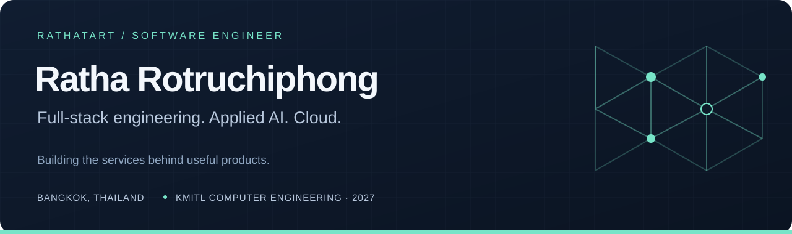
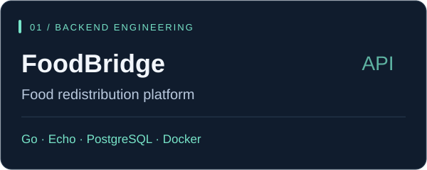
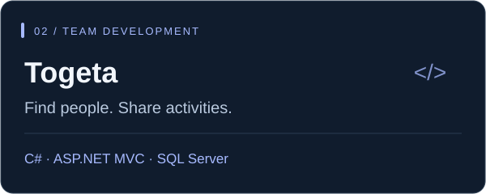
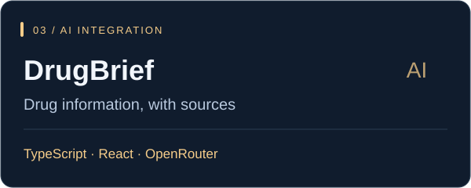
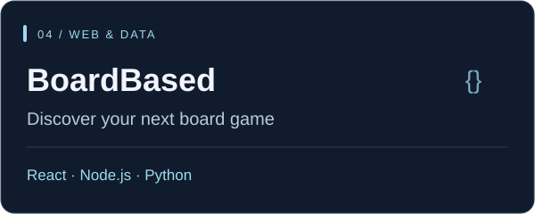

  

  <a href="https://www.linkedin.com/in/ratha-rotruchiphong-a2601039a/"><strong>LinkedIn</strong></a> &nbsp; / &nbsp; <a href="mailto:ratha.tart@gmail.com"><strong>Email me</strong></a> &nbsp; / &nbsp;
  <a href="#selected-projects"><strong>Explore my work</strong></a> &nbsp; / &nbsp;
  <a href="#experience"><strong>Experience</strong></a>

## Hi, I'm Tart 👋

I'm **Ratha Rotruchiphong**, a Software Engineer at **NoviTech AI Solutions** and a **Computer Engineering student at KMITL**, graduating in **2027**. I build full-stack web applications and backend services, integrate AI/LLM features, and deploy applications on AWS.

My work spans agri-tech products, government workflow systems, and collaborative web applications. I enjoy connecting the pieces—from database design and API development to the interface people actually use.

  

## Selected projects

<table>
<tr>
<td width="50%" valign="top">

<strong>My contribution:</strong> designed the backend API and database structure, containerized the development environment, and set up deployment on Render with Aiven PostgreSQL.

<a href="https://github.com/RathaTart/FoodBridge"><strong>Explore FoodBridge →</strong></a>

</td>
<td width="50%" valign="top">

<strong>My contribution:</strong> backend development, post scheduling and moderation, email/web notifications, and Entity Framework Core data access for a team-built activity platform.

<a href="https://github.com/RathaTart/Togeta"><strong>Explore Togeta →</strong></a> · Team project fork

</td>
</tr>
<tr>
<td width="50%" valign="top">

Thai and English drug-information search with AI-generated summaries, reference links, and server-side provider integration. An informational tool requiring source verification.

<a href="https://github.com/RathaTart/drugbrief"><strong>Explore DrugBrief →</strong></a>

</td>
<td width="50%" valign="top">

A KMITL team project combining a board-game discovery interface, HTTP API, and Python crawler. The repository includes the original team credits and setup guide.

<a href="https://github.com/RathaTart/BoardBased-App"><strong>Explore BoardBased →</strong></a> · Team project fork

</td>
</tr>
</table>

## Experience

**Software Engineer · NoviTech AI Solutions** 
*April 2026–present · Bangkok*

- Build AI/LLM features for agri-tech products, including pipeline design, prompts, and model-output evaluation.
- Design and deploy AWS services with attention to cost and performance.
- Deliver features across backend services, data layers, and frontend integration.

**Backend Developer · Chachoengsao PAO Management System** 
*August–September 2025 · Project with Chachoengsao Provincial Administrative Organization*

- Developed an intranet supporting council meetings, official documents, royal decorations tracking, and approval workflows.
- Built REST APIs with Go/Echo and PostgreSQL, using role-based access control, MinIO storage, Docker, and SMS notifications.

<strong>More experience · Computer vision</strong>

**AI Engineer · Border Surveillance System Project** 
*December 2025–present · Joint project with NT and the Royal Thai Army*

Prototyping computer-vision models with Python and YOLO for person detection in complex forest environments.

## Technical toolkit

| Area | Technologies |
| --- | --- |
| Backend & APIs | Go, Echo, C#, ASP.NET Core, Entity Framework Core, REST APIs |
| AI & data | Python, LLM integration, prompt engineering, OpenCV, NumPy, Pandas |
| Databases & storage | PostgreSQL, SQL Server, SQL, MinIO |
| Cloud & delivery | AWS, Docker, Git, Render, Aiven, Postman |
| Web & interface | HTML, CSS, JavaScript; React and TypeScript in recent projects; Figma |

## Education & research

**B.Eng. in Computer Engineering · King Mongkut's Institute of Technology Ladkrabang (KMITL)** 
Expected graduation: **2027** · GPA: **3.21**

Previously studied Science and Mathematics at **Kamnoetvidya Science Academy (KVIS)**, 2019–2022.

**Publication:** *EEG-BBNet: A Hybrid Framework for Brain Biometric using Graph Connectivity* — IEEE ECTI-CON, 2022.

<strong>More projects & experiments</strong>

- [Birthday Escape Room](https://github.com/RathaTart/Brother_Birthday_Escape_Room) — a browser puzzle game built with HTML, CSS, and vanilla JavaScript.
- [Multimedia Study Quiz](https://github.com/RathaTart/Multimedia) — a Thai-language study tool built with React and Tailwind CSS.
- [Digital Slot Machine](https://github.com/RathaTart/KMITL-Digital-Slot-Machine) — team coursework with circuit schematics, state diagrams, Arduino, and FPGA resources.
- [BoardBased Frontend](https://github.com/RathaTart/BoardBased-frontend) — the team's separate React and TypeScript frontend.

---

**Let's connect:** [ratha.tart@gmail.com](mailto:ratha.tart@gmail.com) · Bangkok, Thailand 
Interested in full-stack and software engineering opportunities where I can turn practical problems into useful, maintainable software.

<!-- Original visuals and layout. Design references are documented in DESIGN.md. -->
